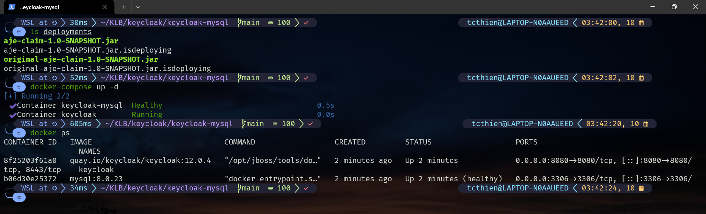
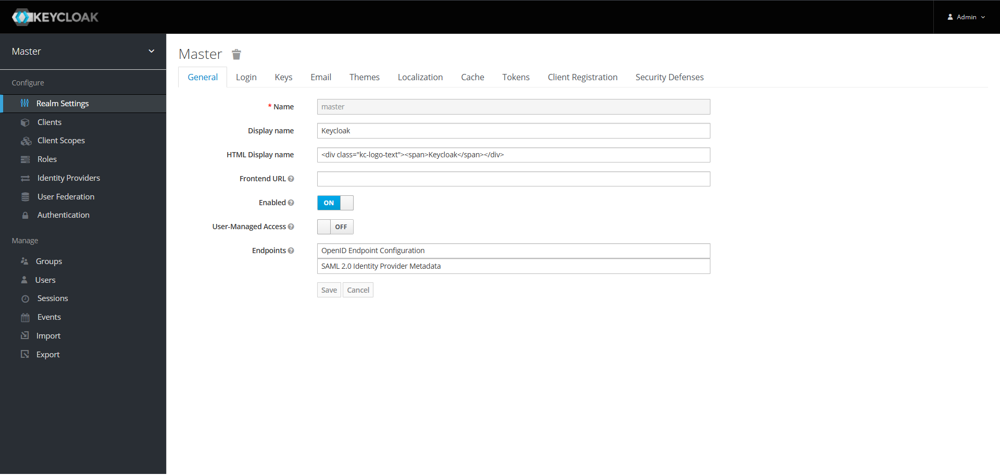
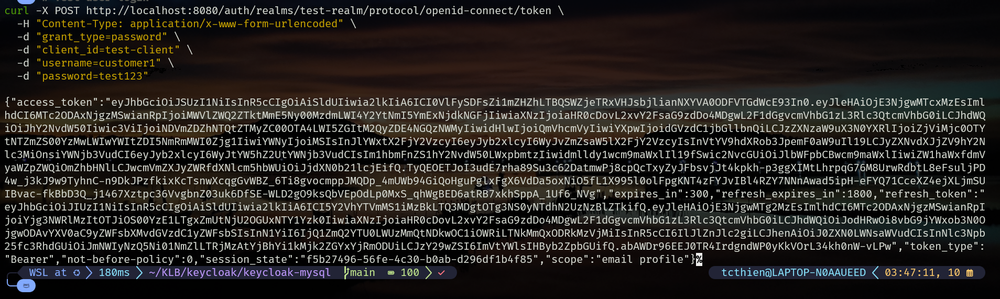
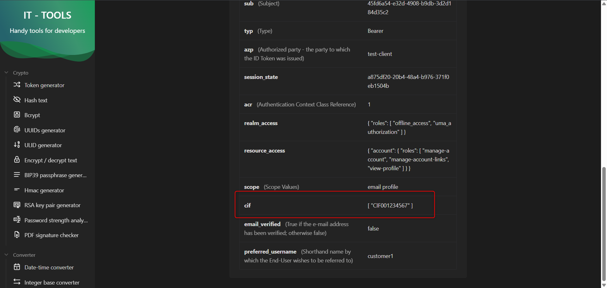

# Keycloak 12 + MySQL 8 Lab Environment

## **🎯 Purpose**

Lab environment to test Keycloak 12 with MySQL 8 database and custom token mappers, preparing for upgrade to higher versions (17/20/26).

## **📁 Project Structure**

```
keycloak-mysql/
├── aje-keycloak-token-mapper-k8s-prod/  # Custom mapper source code
│   ├── src/main/java/                   # Java mapper classes
│   │   ├── BranchOIDCProtocolMapper.java   # Branch mapper
│   │   ├── CifOIDCProtocolMapper.java      # Customer ID mapper
│   │   ├── UserLevelOIDCProtocolMapper.java # User level mapper
│   │   └── PermissionsOIDCProtocolMapper.java # Permissions mapper
│   ├── src/main/resources/META-INF/     # Service registration
│   │   ├── services/org.keycloak.protocol.ProtocolMapper  # Mapper registration
│   │   └── jboss-deployment-structure.xml # JBoss configuration
│   ├── pom.xml                          # Maven config
│   └── Dockerfile                       # Build container
├── deployments/                         # JAR files for Keycloak
├── images/                             # Documentation images
├── docker-compose.yml                   # Main compose file
├── README.md                           # This file
└── .gitignore                          # Git ignore rules

```

## **🔑 Standard Credentials**

### **Keycloak Admin**

- **URL:** [http://localhost:8080/auth](http://localhost:8080/auth)
- **Username:** `admin`
- **Password:** `admin_password`

### **MySQL Database**

- **Host:** localhost:3306
- **Database:** `keycloak`
- **User:** `keycloak_user`
- **Password:** `keycloak_password`
- **Root Password:** `supersecretpassword`

### **Test Data (Standard)**

- **Realm:** `test-realm`
- **Client:** `test-client`
- **Test User:** `customer1` / `test123`
- **Customer ID Attribute:** `CIF001234567`
- **Branch Attribute:** `MAIN_BRANCH`

## **🚀 Quick Start**

### **Step 1: Build Custom Mapper**

```bash
# Build custom token mapper JAR
docker-compose --profile build run --rm build-mapper
```

### **Step 2: Start Services**

```bash
# Start Keycloak + MySQL
docker-compose up -d

# Check containers status
docker ps

```

**Expected result:**

- `keycloak-mysql` → **Up**
- `keycloak` → **Up**



→ MySQL and Keycloak are up and running

### **Step 3: Access Keycloak**

- **URL:** [http://localhost:8080/auth](http://localhost:8080/auth)
- **Login:** `admin` / `admin_password`



## **🧪 Custom Token Mappers**

### **Overview**

Custom OIDC Protocol Mapper for Keycloak 12 to add custom claims to JWT tokens.

**What is a Token Mapper?**

- Extension plugin for Keycloak
- Allows adding custom information to JWT tokens
- Example: adding branch, customer ID, user permissions to tokens

**Why Custom Mappers?**

- Keycloak default only has basic claims (username, email, roles)
- Organizations need additional business information (branch, customer ID, permissions)
- Custom mappers automatically add these claims from user attributes

### **Available Mappers in this source**

- **BranchOIDCProtocolMapper** - Adds `branch` claim
- **CifOIDCProtocolMapper** - Adds `customer_id` claim
- **UserLevelOIDCProtocolMapper** - Adds `user_level` claim
- **PermissionsOIDCProtocolMapper** - Adds `permissions` claim

### 

## **🔍 Basic Testing**

### **1. Container Health Check**

```bash
# View containers
docker ps

# Check Keycloak logs
docker logs -f keycloak

```

**✅ Success indicators:**

```
Using MySQL database
Keycloak 12.0.4 (WildFly Core 13.0.3.Final) started
Deployed "aje-claim-1.0-SNAPSHOT.jar"

```

### **2. Database Connection Test**

```bash
# Connect to MySQL
docker exec -it keycloak-mysql mysql -u keycloak_user -p
# Password: keycloak_password

```

```sql
-- Verify Keycloak tables exist
SHOW DATABASES;
USE keycloak;
SHOW TABLES;

```

### **3. Create Test Environment**

### **Create Realm**

1. Login Admin Console: [http://localhost:8080/auth](http://localhost:8080/auth) (`admin` / `admin_password`)
2. **Master** dropdown → **Add realm**
3. Name: `test-realm` → **Create**

### **Create Client**

1. **Clients** → **Create**
2. Client ID: `test-client`
3. **Save** → **Settings** tab:
    - Access Type: `public`
    - Direct Access Grants: `ON`

### **Create Test User**

1. **Users** → **Add user**
2. Username: `customer1` → **Save**
3. **Credentials** tab: Set password `test123`
4. **Attributes** tab:
    - `cif`: `CIF001234567`
    - `branch`: `MAIN_BRANCH`

### **4. Test Login Flow**

```bash
# Test user login
curl -X POST http://localhost:8080/auth/realms/test-realm/protocol/openid-connect/token \
  -H "Content-Type: application/x-www-form-urlencoded" \
  -d "grant_type=password" \
  -d "client_id=test-client" \
  -d "username=customer1" \
  -d "password=test123"
```



**✅ Success:** Returns JSON with `access_token`

## **⚙️ Custom Mapper Configuration**

### **Step 1: Add Mapper to Client**

1. **Clients** → Select `test-client` → **Mappers**
2. **Create** → **Mapper Type**: `Customer Information File`
3. **Name**: `cif-mapper`
4. **Token Claim Name**: `cif`
5. **Add to ID token**: ON
6. **Add to access token**: ON
7. **Save**

### **Step 2: Test Token with Custom Claims**

```bash
# Get token and check claims
curl -X POST http://localhost:8080/auth/realms/test-realm/protocol/openid-connect/token \
  -H "Content-Type: application/x-www-form-urlencoded" \
  -d "grant_type=password" \
  -d "client_id=test-client" \
  -d "username=customer1" \
  -d "password=test123"
```

**Verify token:**

1. Copy `access_token` from response
2. Paste into [https://it-tools.tech/jwt-parser](https://it-tools.tech/jwt-parser)
3. Check payload contains fields:

    
    ```json
    {
      "cif": ["CIF001234567"],
      "preferred_username": "customer1",
      ...
    }
    
    ```
    



→ Customer ID claim is present

## **🔧 Troubleshooting**

### **Keycloak Won't Start**

```bash
# Check logs
docker logs keycloak

# Common fix: Restart
docker-compose restart keycloak

# Clean restart if needed
docker-compose down && docker-compose up -d

```

### **MySQL Connection Issues**

```bash
# Test MySQL connection
docker exec -it keycloak-mysql mysql -u root -p
# Password: supersecretpassword

# Check keycloak user
SELECT User, Host FROM mysql.user WHERE User = 'keycloak_user';

```

### **Custom Mapper Issues**

### **Error: Mapper not appearing in Admin Console**

**Cause:** JAR not deployed or Keycloak not loaded

```bash
# Check JAR deployment
docker exec keycloak ls -la /opt/jboss/keycloak/standalone/deployments/

# Check deployment logs
docker logs keycloak | grep -i "deploy"

# Rebuild mapper
docker-compose --profile build run --rm build-mapper
docker-compose restart keycloak

```

### **Error: Token missing claims**

**Causes:**

- User missing corresponding attribute
- Mapper not added to client
- Mapper not enabled

**How to check:**

1. Verify user has attribute:
    - Users → Select user → Attributes
    - Add `cif` = `CIF001234567`
2. Check mapper in client:
    - Clients → Select client → Mappers
    - Must have `Customer Information File` mapper
3. Check mapper configuration:
    - "Add to access token": ON
    - "Add to ID token": ON

### **Port Conflicts**

Edit `docker-compose.yml` if ports are occupied:

```yaml
ports:
  - "8081:8080"  # Keycloak
  - "3307:3306"  # MySQL

```

## **📝 Configuration Details**

### **System Versions**

- **Keycloak:** 12.0.4 (WildFly-based)
- **MySQL:** 8.0.23
- **Java:** 11
- **Maven:** 3.8.4

### **Network & Storage**

- **Network:** `keycloak-net` (bridge)
- **MySQL Volume:** `mysql_data` (persistent)
- **Custom Mappers:** `./deployments/` (mounted)

### **Best Practices**

1. **Always check logs after deployment:**
    
    ```bash
    docker logs keycloak | grep -i "deploy"
    
    ```
    
2. **Test mapper before production:**
    - Create separate test realm
    - Test with different user types
    - Verify tokens on jwt.io
3. **Backup before updates:**
    
    ```bash
    # Backup deployments
    cp -r deployments/ deployments-backup/
    
    # Backup database
    docker exec keycloak-mysql mysqldump -u keycloak_user -p keycloak > backup.sql
    
    ```
    
4. **Monitor performance:**
    - Custom mappers may affect token generation speed
    - Check logs for performance issues

## **🔧 Common Commands**

```bash
# Build mapper
docker-compose --profile build run --rm build-mapper

# Start/Stop
docker-compose up -d
docker-compose down

# Logs
docker logs -f keycloak
docker logs -f keycloak-mysql

# MySQL CLI
docker exec -it keycloak-mysql mysql -u keycloak_user -p

# Check container status
docker-compose ps

# Check disk usage
docker system df

# Clean up (⚠️ Data loss)
docker-compose down -v
docker system prune -f

# Get admin token for API calls
ADMIN_TOKEN=$(curl -s -X POST http://localhost:8080/auth/realms/master/protocol/openid-connect/token \
  -H "Content-Type: application/x-www-form-urlencoded" \
  -d "grant_type=password" \
  -d "client_id=admin-cli" \
  -d "username=admin" \
  -d "password=admin_password" | jq -r '.access_token')

# Test token decode
echo $TOKEN | cut -d. -f2 | base64 -d | jq .

```

## **✅ Test Checklist**

- [ ]  Container health: `docker ps` shows both containers Up
- [ ]  Keycloak logs: "Using MySQL database" + "started"
- [ ]  Custom mapper: "Deployed aje-claim-1.0-SNAPSHOT.jar"
- [ ]  Admin console: Login successful with `admin`/`admin_password`
- [ ]  Test realm: `test-realm` created successfully
- [ ]  Test client: `test-client` with Direct Access Grants ON
- [ ]  Test user: `customer1` with password `test123`
- [ ]  User attributes: `cif` = `CIF001234567`, `branch` = `MAIN_BRANCH`
- [ ]  Mappers added: Branch mapper and CIF mapper in client
- [ ]  Token test: Login returns access_token
- [ ]  Token claims: JWT contains `branch` and `customer_id` fields
- [ ]  Database persistence: Data survives container restart

## **🎯 Next Steps**

1. **Plan upgrade path** - 12 → 17 → 20 → 26