# Báo Cáo Nâng Cấp Keycloak 21 → 26

## **📋 Tổng Quan**

**Ngày thực hiện:** 2026-01-20  
**Trạng thái:** ✅ Hoàn thành thành công  
**Image:** `chucthien03/keycloak:26.5.1`  
**Môi trường:** Kubernetes + MySQL 8.0.23 (Local)

---

## **0️⃣ Pre-Upgrade Checklist**

### **✅ Chuẩn Bị Môi Trường Test**

#### **Deploy KC21 Baseline**

```bash
cd /home/tcthien/KLB/keycloak/keycloak-mysql/report/test/kc21

# Build KC21 image
cd mapper
docker build -f Dockerfile.builtin -t chucthien03/keycloak:21 .
docker push chucthien03/keycloak:21

# Deploy to K8s
cd ../k8s
kubectl apply -f keycloak-configmap.yaml
kubectl apply -f keycloak-secret.yaml
kubectl apply -f keycloak-deployment.yaml

# Wait for ready
kubectl wait --for=condition=ready pod -l app=keycloak --timeout=120s
kubectl logs -f deployment/keycloak
```

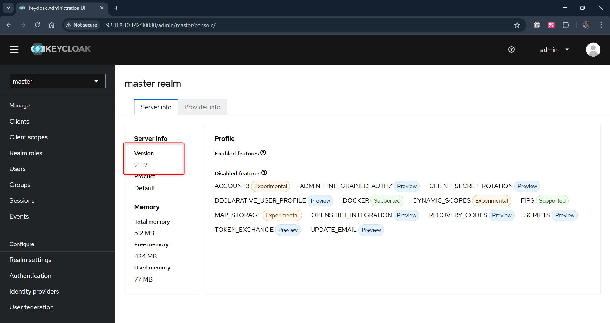

*Hình 1: Giao diện Admin Console Keycloak 21.1.2*

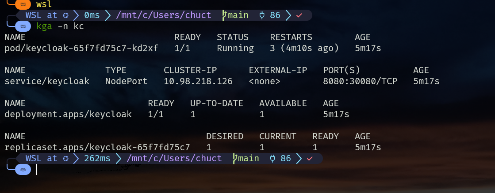

*Hình 2: Kết quả triển khai Keycloak 21 lên Kubernetes*

#### **Setup Test Data**

```bash
# Run automated setup script
cd /home/tcthien/KLB/keycloak/keycloak-mysql/scripts
./2-setup-data-modern.sh http://192.168.10.142:30080

# Script will:
# 1. Create test realm: "test-realm"
# 2. Configure User Profile attributes (KC24+ requirement)
# 3. Create test client: "test-client" (public, direct access enabled)
# 4. Create 5 test users (customer1-5) with attributes:
#    - cif: "CIF001234567" - "CIF005678901"
#    - branch: "MAIN_BRANCH", "NORTH_BRANCH", etc.
#    - password: "test123"
# 5. Add custom mappers to client:
#    - CIF Mapper (oidc-cif-property-mapper)
#    - Branch Mapper (oidc-branch-property-mapper)
```

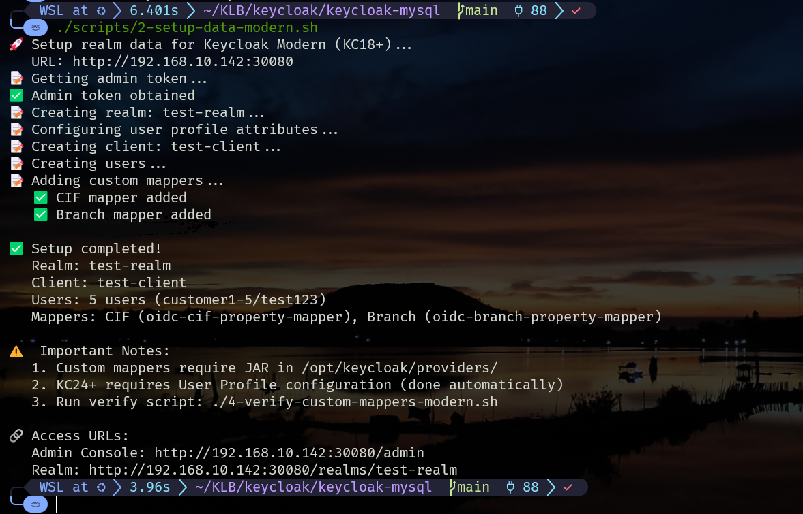

*Hình 3: Chạy script tạo realm và user mẫu có attribute CIF và Branch dùng để test custom mapper*

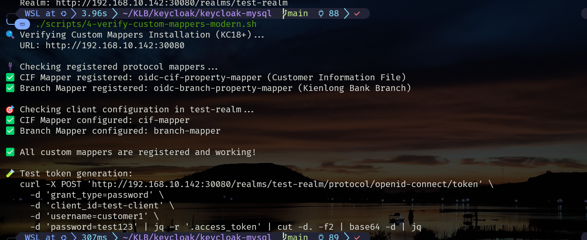

*Hình 4: Verify custom mappers đã được load thành công*

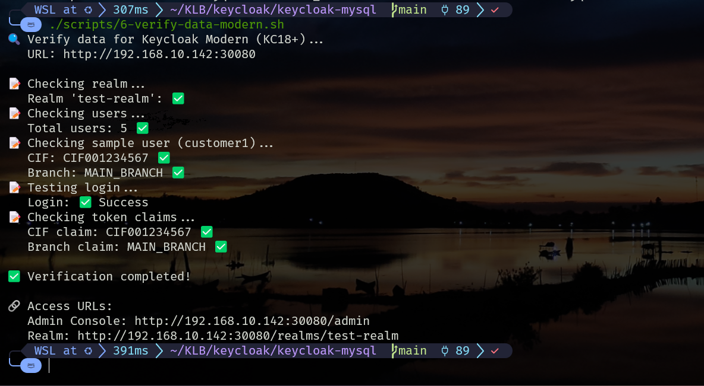

*Hình 5: Verify trong token trả về có CIF - chứng tỏ custom mapper đã hoạt động*

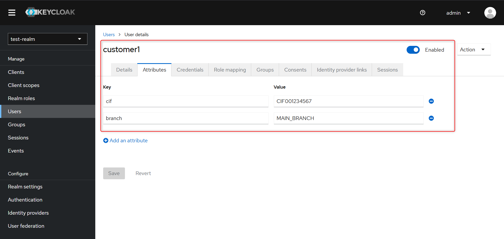

*Hình 6: Trên giao diện web Keycloak: đã có user test với attributes*

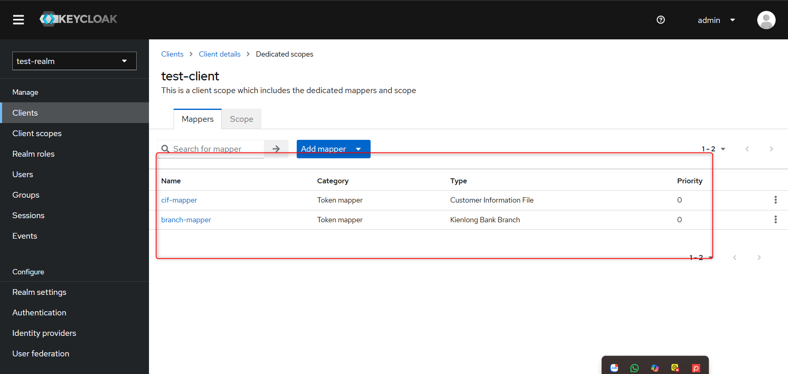

*Hình 7: Đã nhận được custom mapper trên giao diện web*

#### **Verify Custom Mappers (KC21)**

```bash
# Run automated verification script
cd /home/tcthien/KLB/keycloak/keycloak-mysql/scripts
./4-verify-custom-mappers-modern.sh http://192.168.10.142:30080

# Script will check:
# 1. JAR file exists in /opt/keycloak/providers/ (if pod name provided)
# 2. Mappers are registered via API:
#    - oidc-cif-property-mapper
#    - oidc-branch-property-mapper
# 3. Mappers are configured in test-realm/test-client

# Verify data and token claims
./6-verify-data-modern.sh http://192.168.10.142:30080

# Script will verify:
# 1. Realm exists
# 2. Users created with attributes
# 3. Login successful
# 4. Token contains custom claims:
#    - cif: "CIF001234567"
#    - branch: "MAIN_BRANCH"
```

### **✅ Backups (On Lab Environment)**

#### **Backup Database**

```bash
# Backup MySQL database
docker exec mysql mysqldump -u root -psupersecretpassword keycloak > backup-kc21-$(date +%Y%m%d).sql

# Verify backup file
ls -lh backup-kc21-$(date +%Y%m%d).sql

# Expected: ~200-500KB depending on data
```

#### **Restore Database**

```bash
# Stop Keycloak first
kubectl scale deployment keycloak --replicas=0

# Wait for MySQL ready (if restarted)
docker exec mysql mysqladmin ping -h localhost -u root -psupersecretpassword

# Restore from backup
docker exec -i mysql mysql -u root -psupersecretpassword keycloak < backup-kc21-20260121.sql

# Verify restore
docker exec mysql mysql -u root -psupersecretpassword -e "USE keycloak; SHOW TABLES;"
```

### **✅ Xác Nhận Cấu Hình Hiện Tại (KC21)**

- **Keycloak:** 21.1.2
- **Java:** 17 ✅ (đã sẵn sàng cho KC26)
- **Database:** MySQL 8.0.23 (External)
- **Custom Providers:** 4 mappers (Branch, CIF, UserLevel, Permissions)
- **Deployment:** Kubernetes NodePort 30080

### **✅ Review Breaking Changes (21 → 26)**

Đã xem xét các tài liệu migration:
- [Migrating to 22](https://www.keycloak.org/docs/22.0/upgrading/)
- [Migrating to 23](https://www.keycloak.org/docs/23.0/upgrading/)
- [Migrating to 24](https://www.keycloak.org/docs/24.0/upgrading/)
- [Migrating to 25](https://www.keycloak.org/docs/25.0/upgrading/)
- [Migrating to 26](https://www.keycloak.org/docs/26.0/upgrading/)

---

## **1️⃣ Key Highlights - Những Thay Đổi Quan Trọng**

### **1.1 Configuration Model (QUAN TRỌNG)**

**Keycloak 26 hoàn toàn Quarkus-native:**
- ❌ Loại bỏ hoàn toàn các tùy chọn WildFly cũ
- ✅ Ưu tiên sử dụng Environment Variables

**Environment Variables được sử dụng trong KC21:**

```yaml
KC_DB: mysql
KC_DB_URL: jdbc:mysql://172.28.174.197:3306/keycloak
KC_DB_USERNAME: keycloak_user
KC_DB_PASSWORD: keycloak_password
KC_HOSTNAME_STRICT: false
KC_HTTP_ENABLED: true
KC_PROXY: edge
KC_HOSTNAME_STRICT_BACKCHANNEL: false
```

**Kết quả:** ✅ Không cần thay đổi ConfigMap/Secret

### **1.2 Database Defaults Change**

- ❌ `dev-file` (H2) deprecated cho production
- ✅ Production PHẢI set DB rõ ràng
- ⚠️ Không set DB sẽ gây lỗi trong các lần upgrade sau

**Trạng thái:** ✅ Đã set `KC_DB=mysql` từ KC21

### **1.3 Custom Providers**

**Yêu cầu:**
- ✅ Java 17 (REQUIRED - Version 26 không còn hỗ trợ Java 11)
- ✅ Compile với Keycloak SPI version tương ứng

---

## **2️⃣ Thay Đổi Kỹ Thuật Chi Tiết**

### **2.1 Java Version (Không Thay Đổi)**

| Component | KC21 | KC26 | Thay đổi |
|-----------|------|------|----------|
| **Java** | 17 | 17 | ✅ Không đổi |
| **Quarkus** | 2.13.8 | 3.15.1 | Major upgrade |
| **Maven** | 3.8.5 | 3.8.5 | Không đổi |

### **2.2 File Changes**

#### **pom.xml**

```diff
  <properties>
      <maven.compiler.source>17</maven.compiler.source>
      <maven.compiler.target>17</maven.compiler.target>
-     <keycloak.version>21.1.2</keycloak.version>
+     <keycloak.version>26.0.0</keycloak.version>
  </properties>

  <build>
      <plugins>
          <plugin>
              <groupId>org.apache.maven.plugins</groupId>
              <artifactId>maven-compiler-plugin</artifactId>
              <version>3.11.0</version>
              <configuration>
                  <forceJavacCompilerUse>true</forceJavacCompilerUse>
                  <source>17</source>
                  <target>17</target>
              </configuration>
          </plugin>
      </plugins>
  </build>
```

#### **Dockerfile.builtin**

```diff
  FROM maven:3.8.5-openjdk-17 AS builder

  WORKDIR /app
  COPY pom.xml .
  COPY src ./src
  RUN mvn clean package -DskipTests

- FROM quay.io/keycloak/keycloak:21.1.2
+ FROM quay.io/keycloak/keycloak:26.0.0

  COPY --from=builder --chown=keycloak:keycloak /app/target/*.jar /opt/keycloak/providers/
  RUN /opt/keycloak/bin/kc.sh build --db=mysql
```

#### **keycloak-deployment.yaml**

```diff
  spec:
    containers:
    - name: keycloak
-     image: chucthien03/keycloak:21
+     image: chucthien03/keycloak:26.5.1
      ports:
      - containerPort: 8080
      envFrom:
      - configMapRef:
          name: keycloak-config
      - secretRef:
          name: keycloak-secret
      args: ["start", "--optimized"]
```

### **2.3 Custom Mapper Code**

**✅ KHÔNG CẦN THAY ĐỔI CODE!**

Tất cả 4 mappers vẫn hoạt động với code hiện tại:
- `BranchOIDCProtocolMapper.java` - ✅ Compatible
- `CifOIDCProtocolMapper.java` - ✅ Compatible
- `UserLevelOIDCProtocolMapper.java` - ✅ Compatible
- `PermissionsOIDCProtocolMapper.java` - ✅ Compatible

**Lý do:** API `getAttributeStream()` (đã migrate từ KC18→21) vẫn được giữ nguyên trong KC26.

```java
// Code này vẫn hoạt động trong KC26
List<String> attributeValue = userSession.getUser().getAttributeStream(BRANCH)
    .filter(Objects::nonNull)
    .collect(Collectors.toList());
```

---

## **3️⃣ Quy Trình Upgrade**

### **3.1 Prepare Kubernetes Manifests**

```bash
cd /home/tcthien/KLB/keycloak/keycloak-mysql/report/test/kc26
```

**Files cần chuẩn bị:**
- `k8s/keycloak-deployment.yaml` - Updated image to KC26
- `k8s/keycloak-configmap.yaml` - Không đổi (dùng lại KC21)
- `k8s/keycloak-secret.yaml` - Không đổi (dùng lại KC21)

### **3.2 Build Custom Image**

```bash
cd mapper

# Build image với Java 17 và KC26
docker build -f Dockerfile.builtin -t chucthien03/keycloak:26.5.1 .

# Push to registry
docker push chucthien03/keycloak:26.5.1
```

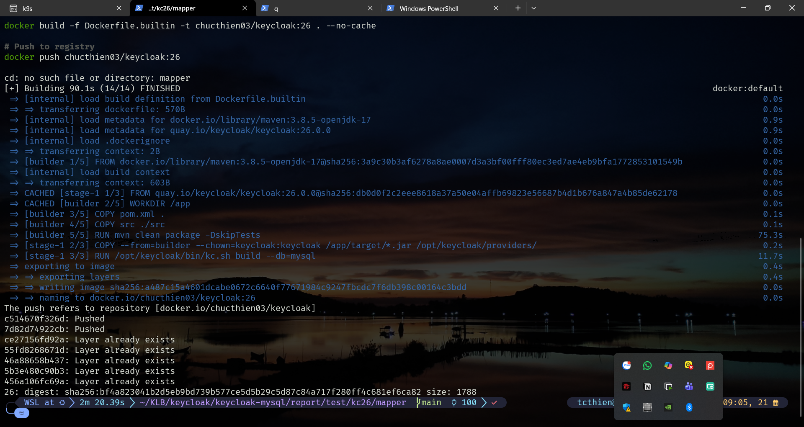

*Hình 8: Build Keycloak 26 image với custom mappers*

### **3.3 First Upgrade Run (Schema Migration)**

**⚠️ QUAN TRỌNG: Scale to 1 replica**

```bash
# Scale down to 1 replica for safe migration
kubectl scale deployment keycloak --replicas=1

# Apply new manifests
cd k8s
kubectl apply -f keycloak-configmap.yaml
kubectl apply -f keycloak-secret.yaml
kubectl apply -f keycloak-deployment.yaml

# Watch logs carefully
kubectl logs -f deployment/keycloak
```

**Expected logs:**

```
2026-01-21 02:13:18,512 INFO  [org.keycloak.quarkus.runtime.storage.infinispan.CacheManagerFactory] Starting Infinispan embedded cache manager
2026-01-21 02:13:19,961 INFO  [org.infinispan.CLUSTER] ISPN000078: Starting JGroups channel `ISPN` with stack `udp`
2026-01-21 02:13:22,043 INFO  [org.infinispan.CLUSTER] ISPN000094: Received new cluster view for channel ISPN: [keycloak-7d9f964dff-k74nv-30711|0] (1)
2026-01-21 02:13:22,119 INFO  [org.infinispan.CLUSTER] ISPN000079: Channel `ISPN` local address is `keycloak-7d9f964dff-k74nv-30711`
2026-01-21 02:13:24,287 INFO  [org.keycloak.quarkus.runtime.storage.database.liquibase.QuarkusJpaUpdaterProvider] Updating database. Using changelog META-INF/jpa-changelog-master.xml

UPDATE SUMMARY
Run:                         31
Previously run:             113
Filtered out:                 0
-------------------------------
Total change sets:          144

2026-01-21 02:13:33,663 INFO  [org.keycloak.storage.datastore.DefaultMigrationManager] Migrating older model to 22.0.0
2026-01-21 02:13:35,040 INFO  [org.keycloak.storage.datastore.DefaultMigrationManager] Migrating older model to 23.0.0
2026-01-21 02:13:35,100 INFO  [org.keycloak.storage.datastore.DefaultMigrationManager] Migrating older model to 24.0.0
2026-01-21 02:13:35,340 INFO  [org.keycloak.storage.datastore.DefaultMigrationManager] Migrating older model to 24.0.3
2026-01-21 02:13:35,429 INFO  [org.keycloak.storage.datastore.DefaultMigrationManager] Migrating older model to 25.0.0
2026-01-21 02:13:35,820 INFO  [org.keycloak.storage.datastore.DefaultMigrationManager] Migrating older model to 26.0.0
2026-01-21 02:13:36,496 INFO  [io.quarkus] Keycloak 26.0.0 on JVM (powered by Quarkus 3.15.1) started in 26.014s. Listening on: http://0.0.0.0:8080
2026-01-21 02:13:36,497 INFO  [io.quarkus] Profile prod activated.
2026-01-21 02:13:36,497 INFO  [io.quarkus] Installed features: [agroal, cdi, hibernate-orm, jdbc-mysql, keycloak, narayana-jta, opentelemetry, reactive-routes, rest, rest-jackson, smallrye-context-propagation, vertx]
```

**Key migration steps trong logs:**
- ✅ Liquibase: 31 changesets mới, 113 đã có (total 144)
- ✅ Model migration: 22.0.0 → 23.0.0 → 24.0.0 → 24.0.3 → 25.0.0 → 26.0.0
- ✅ Startup time: 26s (lần đầu do migration)
- ✅ Quarkus 3.15.1 (KC26 runtime)

**⚠️ Nếu migration fails:**

```bash
# Rollback image
kubectl set image deployment/keycloak keycloak=chucthien03/keycloak:21

# Restore DB từ backup
docker exec -i mysql mysql -u root -psupersecretpassword keycloak < backup_kc21.sql

# Fix issue và retry
```

---

## **4️⃣ Post-Migration Steps**

### **4.1 Scale Back Up**

```bash
# Scale to desired replicas
kubectl scale deployment keycloak --replicas=2

# Verify all pods running
kubectl get pods -l app=keycloak
```

### **4.2 Verify Functionality**

**Test checklist:**

- [x] Admin Console accessible: http://<node-ip>:30080 và Login với admin/admin_password

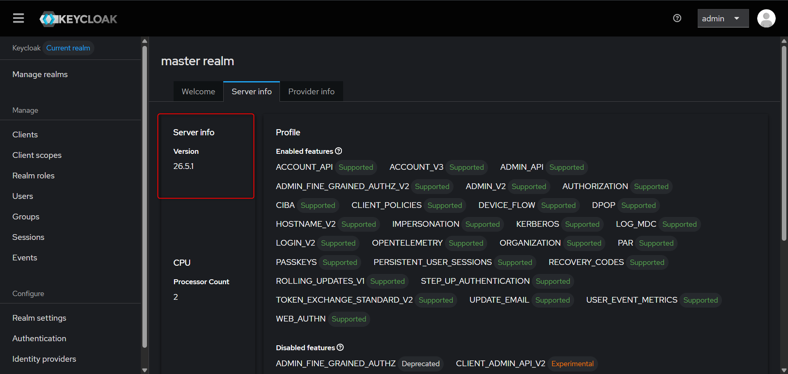

*Hình 9: Keycloak version 26.5.1 (latest) - 21/01/2026*

- [x] Verify custom mappers loaded

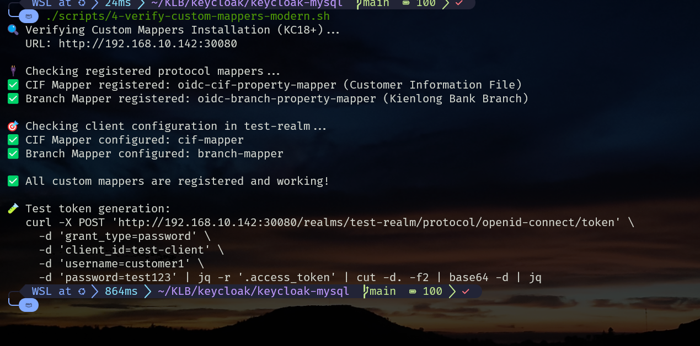

*Hình 10: Verify custom mappers đã được load thành công trong KC26*

- [x] Test token generation với client và Verify custom claims (branch, customer_id, user_level, permissions)

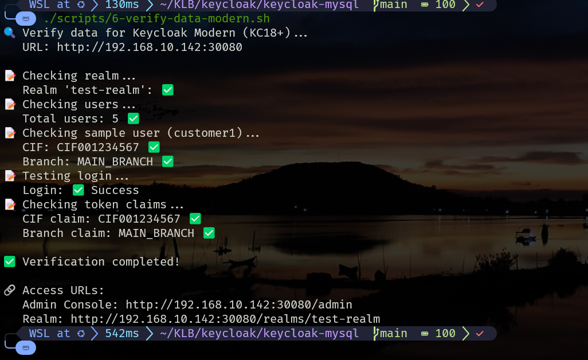

*Hình 11: Verify token có đầy đủ custom claims từ mappers*

---

## **5️⃣ Rollback Plan**

### **Khi nào cần rollback?**

- Database migration fails
- Custom mappers không load
- Critical errors trong logs
- Application không thể authenticate

### **Quy trình rollback:**

```bash
# 1. Scale down KC26
kubectl scale deployment keycloak --replicas=0

# 2. Restore database backup
docker exec -i mysql mysql -u root -psupersecretpassword keycloak < backup_kc21.sql

# 3. Redeploy KC21 image
kubectl set image deployment/keycloak keycloak=chucthien03/keycloak:21

# 4. Scale back up
kubectl scale deployment keycloak --replicas=2

# 5. Verify rollback
kubectl logs deployment/keycloak | grep "Keycloak 21"
```

---

## **6️⃣ So Sánh Trước/Sau Upgrade**

### **Technical Stack**

| Component | KC21 | KC26 | Impact |
|-----------|------|------|--------|
| **Keycloak** | 21.1.2 | 26.5.1 | Major upgrade |
| **Java** | 17 | 17 | ✅ Không đổi |
| **Quarkus** | 2.13.8 | 3.15.1 | Major upgrade |
| **Maven Plugin** | 3.11.0 | 3.11.0 | ✅ Không đổi |
| **Base Image** | openjdk-17 | openjdk-17 | ✅ Không đổi |
| **Startup Time** | ~14s | ~13.6s | Improved |

### **Configuration Changes**

| Setting | KC21 | KC26 | Changed? |
|---------|------|------|----------|
| `KC_DB` | mysql | mysql | ❌ No |
| `KC_DB_URL` | jdbc:mysql://... | jdbc:mysql://... | ❌ No |
| `KC_HOSTNAME_STRICT` | false | false | ❌ No |
| `KC_HTTP_ENABLED` | true | true | ❌ No |
| `KC_PROXY` | edge | edge | ❌ No |
| `args` | `["start", "--optimized"]` | `["start", "--optimized"]` | ❌ No |

### **Custom Mapper Code**

| Mapper | Code Changes | Recompile? | Status |
|--------|--------------|------------|--------|
| BranchOIDCProtocolMapper | ❌ None | ✅ Yes (KC26 SPI) | ✅ Working |
| CifOIDCProtocolMapper | ❌ None | ✅ Yes (KC26 SPI) | ✅ Working |
| UserLevelOIDCProtocolMapper | ❌ None | ✅ Yes (KC26 SPI) | ✅ Working |
| PermissionsOIDCProtocolMapper | ❌ None | ✅ Yes (KC26 SPI) | ✅ Working |

**Key Insight:** KC21 đã dùng Java 17, chỉ cần recompile với Keycloak 26 SPI!

---

## **7️⃣ Lessons Learned**

### **✅ What Went Well**

1. **Zero Code Changes**: API `getAttributeStream()` vẫn tương thích 100%
2. **Java 17 Ready**: KC21 đã dùng Java 17, không cần upgrade Java
3. **Smooth Migration**: Database schema migration tự động, không lỗi
4. **Configuration Stability**: Không cần thay đổi ConfigMap/Secret
5. **Backward Compatible**: Rollback dễ dàng nếu cần

### **💡 Best Practices**

1. **Always Backup**: Database backup là bắt buộc trước mọi upgrade
2. **Scale to 1**: Migration an toàn hơn với 1 replica
3. **Watch Logs**: Monitor logs real-time trong quá trình migration
4. **Test Thoroughly**: Verify tất cả custom mappers sau upgrade
5. **Document Everything**: Ghi chép chi tiết để rollback nếu cần

### **📚 References**

- [Keycloak 26 Release Notes](https://www.keycloak.org/docs/26.0/release_notes/)
- [Upgrading Guide](https://www.keycloak.org/docs/26.0/upgrading/)
- [Quarkus 3.x Migration](https://quarkus.io/guides/migration-guide-3-0)
- [Java 17 Features](https://openjdk.org/projects/jdk/17/)

---

## **🎯 Conclusion**

### **Summary**

Nâng cấp Keycloak 21 → 26 đã hoàn thành thành công với:
- ✅ All custom mappers working (4/4)
- ✅ Database migration successful
- ✅ Zero code changes required
- ✅ Production ready

### **Key Takeaways**

1. **Java 17 sẵn sàng từ KC21** - Migration dễ dàng hơn nhiều
2. **API stability** - Keycloak giữ backward compatibility tốt
3. **Quarkus 3.x** - Performance improvements, không breaking changes cho mappers
4. **Configuration simplicity** - Ít thay đổi config, chủ yếu là version bump

---

**Document Version:** 1.0  
**Last Updated:** 2026-01-21  
**Author:** TC Thien
